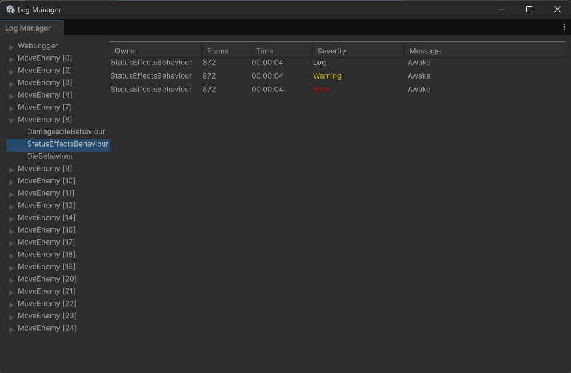

# Editor Windows

## Log Inspector

The log inspector is a custom inspector that allows you to view all the logs on a GameObject. You can open the Log Inspector by going `Tools > Logger > Inspector` or `shift + l`. This will show all the logs from all loggers from the currently selected GameObject.

## Logger Overview

The log viewer is a custom inspector that allows you to view all the loggers/logs registered with the LogManager. You can open the Log Manager by going `Tools > Logger > Overview` or `ctrl + l`.

