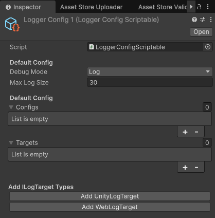
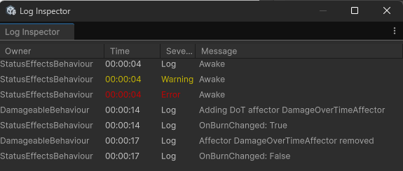

# Getting Started

## About

The `CrashKonijn.Logger` package is a simple logging library for Unity. It is designed to be easy to use and flexible. It allows you to create loggers for different classes and objects, and log messages with different levels of severity.

Each logger can belong to a GameObject, this allows you view the logs of all loggers that are connected to a GameObject in the Unity Editor. This should give you quick insights into what's happening to an object in your game.

## Installation

To get started, you need to install the package from the [asset store](https://assetstore.unity.com/packages/slug/305396).


**Package** This asset will install in the Packages folder.



## Configuring the Loggers

Each project requires a `Logger Config Scriptable` to be present. This will hold all your configuration for the project. You can create it by right-clicking in the project window and selecting `Create > Logger Config Scriptable`.

You can setup the default configuration here. The default configuration will be used for any new logger type that is created for the first time.

### Default Config
- **Min Severity:** The minimum severity that will be logged. Any log message with a severity lower than this will be ignored.
- **Max Log Size:** The max amount of logs that will be kept in memory per logger instance. When the log size exceeds this amount, the oldest logs will be removed.

### Type Configs
You don't need to add anything here. Any time a new logger type is created, it will automatically be added to this list. You can change the configuration for each type here.

### Targets
You can add different targets here. Each target can have its own configuration. You can add a target by using the buttons at the bottom of the window. By default there's two type of targets:

- **UnityLogTarget:** This target will log the messages to the Unity console.
- **WebLogTarget:** This target will forward all messages to the web interface.



## Log Manager Initializer

Before being able to log the `LogManager` needs to be initialized. This can be done using the `LogManagerInitializer`. Create a new GameObject in your scene and add the `LogManagerInitializer` component to it. Make sure to assign the created `LoggerConfigScriptable`. This will initialize the `LogManager` and make sure that all loggers are correctly set up.


**IoC** This package fully supports being used in an IoC container.


## Basic Usage

```csharp
using System;
using CrashKonijn.Logger;
using UnityEngine;

namespace Examples
{
    public class BasicExample : MonoBehaviour
    {
        private IRabbitLogger logger;

        private void Awake()
        {
            // Create a new logger using the factory.
            logger = LoggerFactory.Create<BasicExample>(this);
        }
        
        private void Start() {
            logger.Log("Hello, World!");
        }

        private void OnDestroy()
        {
            // Dispose the logger when the object is destroyed.
            logger.Dispose();
        }
    }
}
```

## View the Logger on a MonoBehaviour
To view the logger on a MonoBehaviour, make sure to add the `SerializeReference` attribute to the logger field or property.

```csharp
// When using a field
[SerializeReference]
private IRabbitLogger logger;

// When using a property
[field: SerializeReference]
public IRabbitLogger Logger { get; set; }
```


**Odin Inspector** The Odin Inspector will show a select field for anything marked as SerialieReference. You can ignore this, don't select anything!



## The LoggerBehaviour
If you don't want to manually handle creating and disposing the logger, you can use the `LoggerBehaviour` combined with the `LoggerFactoryBehaviour`. This will automatically create and dispose the logger for you.

This has also been set up to capture all `Debug.Log` and `print` calls in a class. Simply extending from `LoggerBehaviour` will automatically capture these calls.

```csharp
using CrashKonijn.Logger;

public class ExampleLogBehaviour : LoggerBehaviour
{
    private void Start()
    {
        Debug.Log("Hello, World!");
        Logger.Log("Hello, World 2!");
    }
}
```


## Injected Logger
The `LoggerFactoryBehaviour` will inject a logger into any class on the GameObject that extends `IRequiresLogger` interface. This is how the `LoggerBehaviour` works. You can use this to inject a logger into any class.

```csharp
public class ExampleLogBehaviour : MonoBehaviour, IRequiresLogger {
    [field: SerializeReference]
    public IRabbitLogger Logger { get; set; }

    private void Start()
    {
        Logger.Log("Hello, World!");
    }    
}
```

## Non-MonoBehaviour Loggers
You can also create loggers for classes that don't extend `MonoBehaviour`. This can be done by using the `LoggerFactory.Create` method.

```csharp
public class Example : IDisposable {
    private ILogger logger;
    
    public Example() {
        logger =  LoggerFactory.Create<Example>(this);
    }
    
    public void Dispose() {
        logger.Dispose();
    }
}
```

Any logger can be viewed in the `Logger Overview`, but to also se a logger in the `Logger Inspector` it needs to be attached to a `GameObject`.
```csharp
public class Example : IDisposable {
    private ILogger logger;
    
    public Example(GameObject go) {
        logger =  LoggerFactory.Create<Example>(go);
    }
    
    public void Dispose() {
        logger.Dispose();
    }
}
```

## Log Inspector

The log inspector is a custom inspector that allows you to view all the logs on a GameObject. You can open the Log Inspector by going `Tools > Logger > Inspector` or `shift + l`. This will show all the logs from all loggers from the currently selected GameObject.



## Logger Overview

The log viewer is a custom inspector that allows you to view all the loggers/logs registered with the LogManager. You can open the Log Manager by going `Tools > Logger > Overview` or `ctrl + l`.

