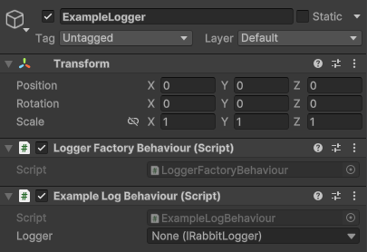

# Logger

The Logger is a class that is responsible for logging messages. It is created using the `LoggerFactory` and is registered with the `LogManager`. Any class that wants to log messages should use their own logger.

## Methods

```csharp
public interface IRabbitLogger : IDisposable
{
    int Id { get; set; }
    string Name { get; }
    string Path { get; set; }
    List<Log> Logs { get; }
    UnityEvent<Log> OnLog { get; }
    ILoggerConfig Config { get; }
    bool ShouldLog();
    bool ReferencesIntact();
    void Handle(string message, DebugSeverity severity, string compiledFileName = null, int compiledLineNumber = 0);
#if DEBUG
    void Log(string message, [CallerFilePath] string filePath = null, [CallerLineNumber] int lineNumber = 0);
    void LogFormat(string format, string arg1, [CallerFilePath] object filePath = null, [CallerLineNumber] int lineNumber = 0);
    void LogFormat(string format, string arg1, string arg2, [CallerFilePath] object filePath = null, [CallerLineNumber] int lineNumber = 0);
    void LogFormat(string format, string arg1, string arg2, string arg3, [CallerFilePath] object filePath = null, [CallerLineNumber] int lineNumber = 0);
    void Warning(string message, [CallerFilePath] string filePath = null, [CallerLineNumber] int lineNumber = 0);
    void LogWarning(string message, [CallerFilePath] string filePath = null, [CallerLineNumber] int lineNumber = 0);
    void LogWarningFormat(string format, string arg1, [CallerFilePath] object filePath = null, [CallerLineNumber] int lineNumber = 0);
    void LogWarningFormat(string format, string arg1, string arg2, [CallerFilePath] object filePath = null, [CallerLineNumber] int lineNumber = 0);
    void LogWarningFormat(string format, string arg1, string arg2, string arg3, [CallerFilePath] object filePath = null, [CallerLineNumber] int lineNumber = 0);
    void Error(string message, [CallerFilePath] string filePath = null, [CallerLineNumber] int lineNumber = 0);
    void LogError(string message, [CallerFilePath] string filePath = null, [CallerLineNumber] int lineNumber = 0);
    void LogErrorFormat(string format, string arg1, [CallerFilePath] object filePath = null, [CallerLineNumber] int lineNumber = 0);
    void LogErrorFormat(string format, string arg1, string arg2, [CallerFilePath] object filePath = null, [CallerLineNumber] int lineNumber = 0);
    void LogErrorFormat(string format, string arg1, string arg2, string arg3, [CallerFilePath] object filePath = null, [CallerLineNumber] int lineNumber = 0);
#else
    void Log(string message);
    void LogFormat(string format, string arg1);
    void LogFormat(string format, string arg1, string arg2);
    void LogFormat(string format, string arg1, string arg2, string arg3);
    void Warning(string message);
    void LogWarning(string message);
    void LogWarningFormat(string format, string arg1);
    void LogWarningFormat(string format, string arg1, string arg2);
    void LogWarningFormat(string format, string arg1, string arg2, string arg3);
    void Error(string message);
    void LogError(string message);
    void LogErrorFormat(string format, string arg1);
    void LogErrorFormat(string format, string arg1, string arg2);
    void LogErrorFormat(string format, string arg1, string arg2, string arg3);
#endif
}
```


**DEBUG** When the scripting define symbol `DEBUG` is defined (aka in the editor and debug builds), the logger will log the file path and line number of the caller. This is useful for debugging purposes.



**XFormat** Even though de Logger matches Unity's Debug methods, the `Format` methods differ slightly. In Unity's version each param is of type `object`, while in the Logger's version each param is of type `string`. This was required to make the Logger work with the `CallerFilePath` and `CallerLineNumber` attributes.





## The LoggerBehaviour
If you don't want to manually handle creating and disposing the logger, you can use the `LoggerBehaviour` combined with the `LoggerFactoryBehaviour`. This will automatically create and dispose the logger for you.

This has also been set up to capture all `Debug.Log` and `print` calls in a class. Simply extending from `LoggerBehaviour` will automatically capture these calls.

```csharp
using CrashKonijn.Logger;

public class ExampleLogBehaviour : LoggerBehaviour
{
    private void Start()
    {
        Debug.Log("Hello, World!");
        Logger.Log("Hello, World 2!");
    }
}
```

