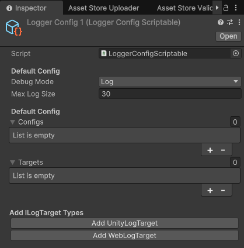
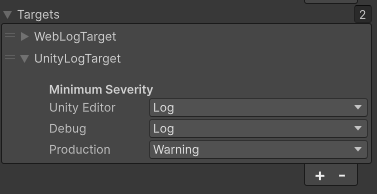

# Unity Log Target

The Unity Log Target is a target that logs messages to the Unity console.

## Usage

To use the Unity Log Target, you need to add it to the `LoggerConfigScriptable` in the Unity Editor.

## Configuration

The different settings for the Unity Log Target define the minimum log level that should be logged to the Unity console, depending on the build type.

- **Unity Editor:** The minimum log level that should be logged to the Unity console when running in the Unity Editor.
- **Debug:** The minimum log level that should be logged to the Unity console when running in a development build.
- **Production:** The minimum log level that should be logged to the Unity console when running in a release build.

