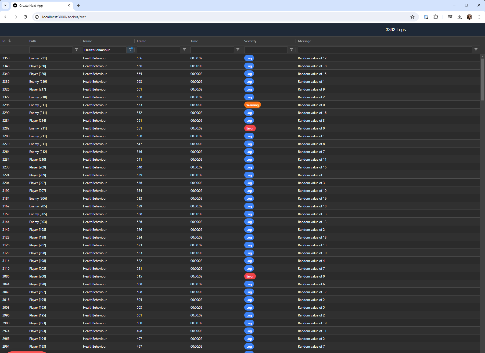
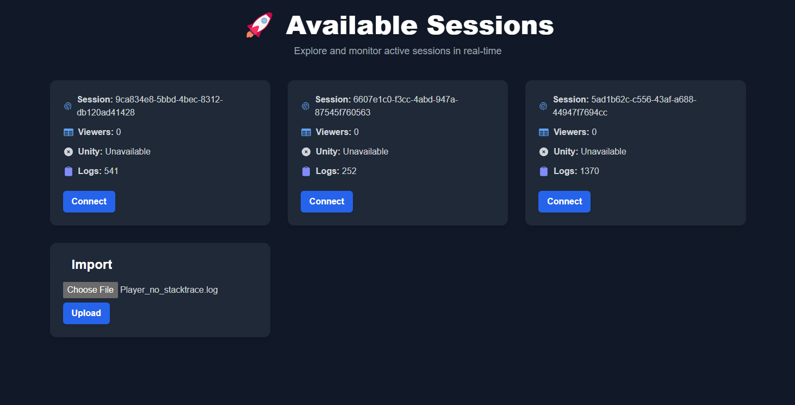

# Web viewer

The web viewer is a docker hosted web application that allows you to view the logs in a web browser. The web viewer contains a searchable table that makes it much easier to view your logs.

A connection to the web viewer can also be made from within a (debug) build of your Unity project. This allows you to view the logs in real-time while the application is running on a device.



## Architecture
The web viewer consists of two parts: the backend and the frontend. These are supplied as two separate docker images.

- **Backend**: The backend is .NET project that serves as the Websocket host. It listens for incoming connections and forwards the logs to the frontend.
- **Frontend**: The frontend is a React application that listens for incoming logs and displays them in a table.

### Data
When unity or the frontend connects to the backend, the backend will create a new `Room` based on the id. This room will store (in memory) all the logs that are sent to it. When no active connection is present, the room will be destroyed and thus the logs will be lost.

## Getting Started

### Unity

The following packages are required to be installed. You can install them using the package manager.

1. Open the package manager, click on the `+` button, and select `Add package from by name`. Paste the following: `com.unity.nuget.newtonsoft-json`
2. Now add the following using `Add package from git URL`: `https://github.com/endel/NativeWebSocket.git#upm`.

Make sure you've created a `Logger Config Scriptable` in a `Resources` folder in your project. You can create it by right-clicking in the project window and selecting `Create > Logger Config Scriptable`.
On the logger there should now be a button to add a new target. Use the `WebLogTarget` button to add a new target.

### Docker
Make sure that you have Docker installed and running on the machine. The following docker-compose.yml file can be used to start the web viewer:


**Product key** You can get the product key from the About editor window in unity. (Tools > Logger > About).




**Sentry** By setting the `USE_SENTRY` environment variable to `true`, you can enable Sentry error tracking. This will report any errors back to me.

Removing this environment variable or setting it to false will disable Sentry.


```yml
services:
  backend:
    image: crashkonijn/rabbit-logger-backend
    ports:
      - "5000:8080"
    environment:
      - PRODUCT_KEY=the-product-key
      - USE_SENTRY=true

  frontend:
    image: crashkonijn/rabbit-logger-frontend
    ports:
      - "3000:3000"
    depends_on:
      - backend
    environment:
      - BACKEND_URL=localhost
      - BACKEND_PORT=5000
      - BACKEND_PROTOCOL=http
```

## Usage
When the docker containers are running, you can navigate to `http://{ip}:{frontend_port}` to access the frontend. The frontend will show you an overview of all the sessions that are present on the backend.



### Importing Player Logs
You can import player logs by selecting a player log and clicking the `Import` button. This will upload the log to the backend and make it available in the frontend. The imported session should show up in the list of sessions.

### Viewing Logs
When you click on a session, you will be taken to the log viewer. Here you can see all the logs that were sent to the backend. You can filter the logs by severity and search for specific logs. This will update live as new logs are sent to the backend.

### Filtering Logs
You can filter any property in the table by typing it in the search fields on top. Double-clicking on a value in a row will toggle that value in the filter.

